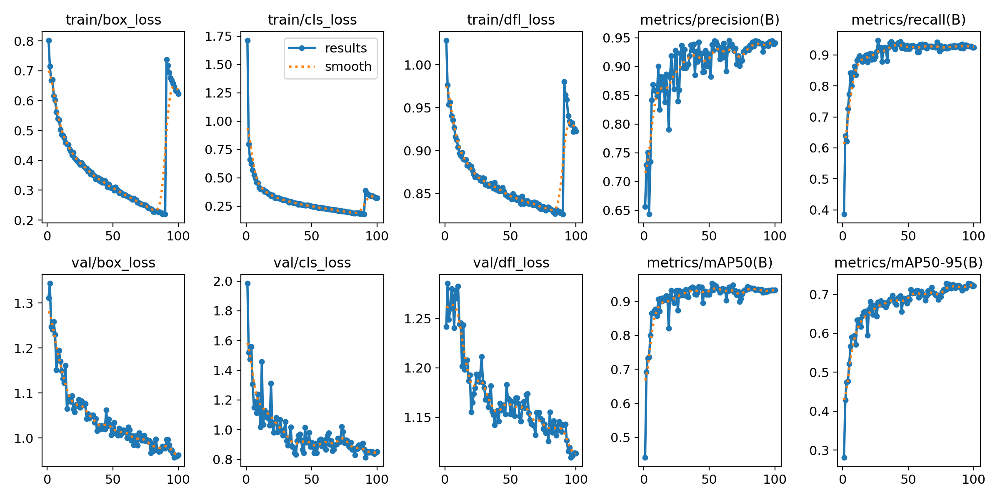
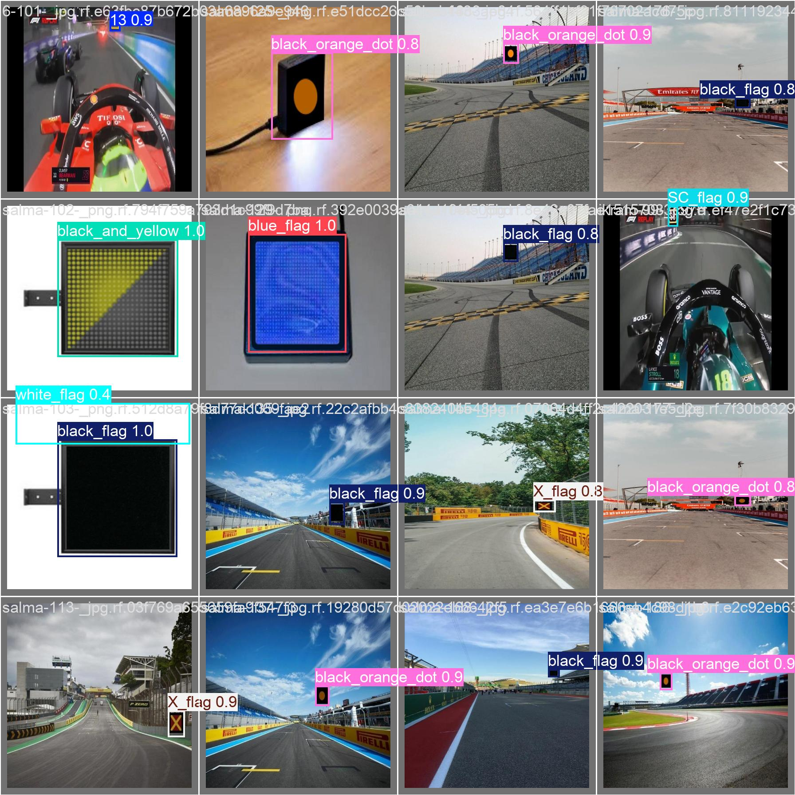
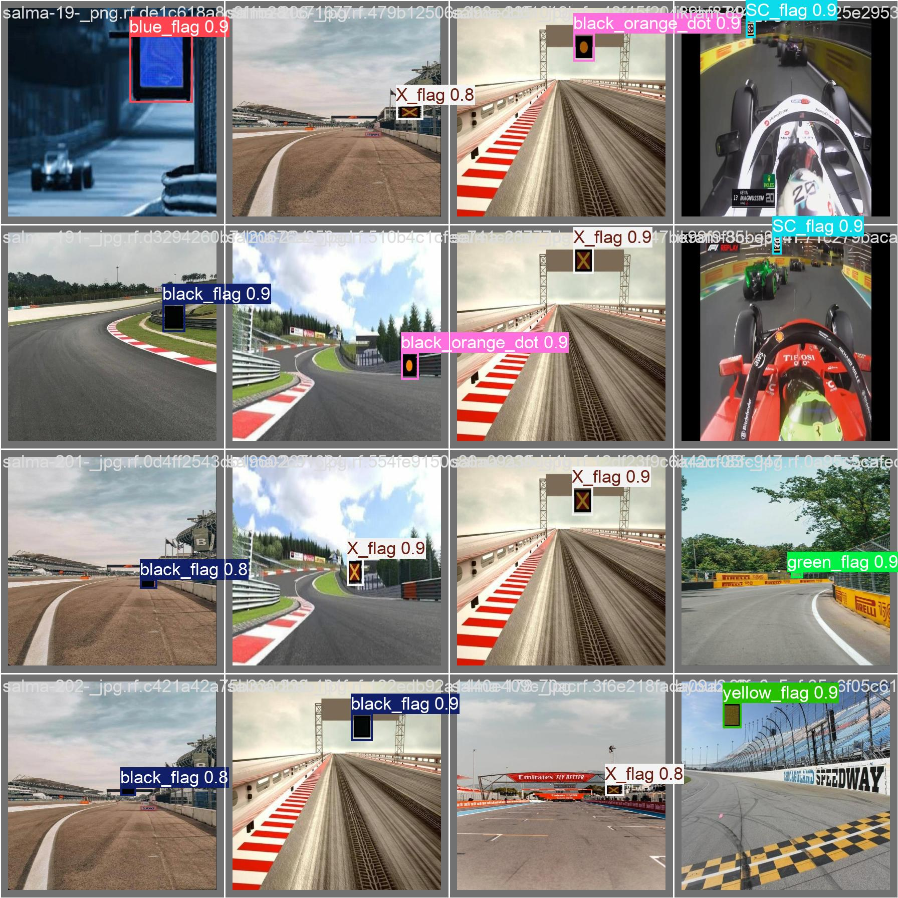
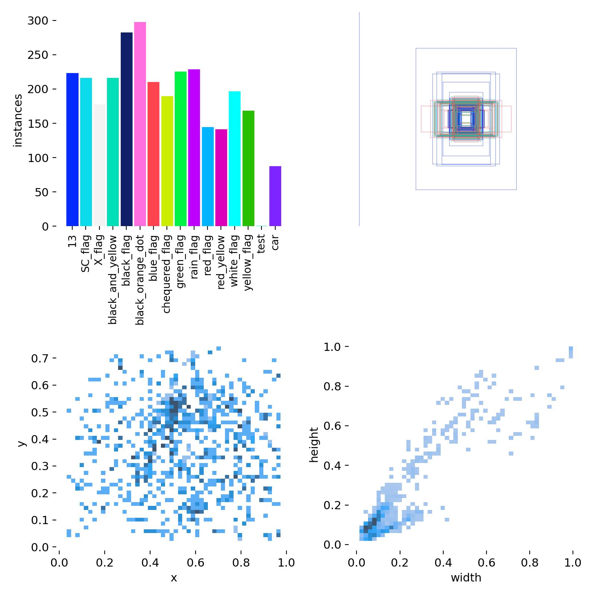

# 🏎️ Yolo - AI driver the futur of motorsport 🏎️

</br>
The objective of this project was to train a vision model that detect FIA (International Automobile Federation) regulation during races. In the futur a AI category of race could appear. This project is aimed to think about how the visions models will be train and the limitation of using it. This work could be important for a company who wants to try to enter in this new categories.

To accomplish this objective I have done this work like if the train vision model will be in a race car in the near futur. For that, I decided to use a fast and lightweight vision model such as Yolov11s. During the race, the vision detection needs to be fast to have the time to modify the car's actions before getting a penalty or a crash. Furthermore, in all the competition you have technical regulations that change according on the category. Having a lightweight vision model allow you to go in all technical regulation and, generally, requires lighter components which is extremely important in racing. This can be important for a company because they will not need to work on a new vision model when the technical regulations of the category change or when they want to enter in a new one.

</br>
<a href="https://docs.ultralytics.com/models/yolo11/" target="_blank">
  
</a>


## 🔧 Setup 🔧

### 💻 Structure of the project 💻

```
├── data/
│   ├── data/
│   │   ├── test/
│   │   ├── train/
│   │   └── val/
│   ├── data.yaml
│   └── yolo11s.pt
├── runs/detect/yolo11s_color_test/
│   ├── weights/
│   │   ├── best.pt
│   │   └── last.pt
│   └── images generate by Yolo
├── test/
│   └── dataset_test_output/
├── README.md
├── test.py
├── train.py
├── yolo11n.pt
└── yolo11s.pt
```

### 🗒️ Prequisites 🗒️


First of all clone the project on your computer
```
git clone https://github.com/BENOITWilliam/AI_driver_the_futur_of_motorsport.git
```

You will need a version of python ≥ [3.12](https://www.python.org/downloads/release/python-3127/https://www.python.org/downloads/release/python-3127/ "Download Python") with :
  * Torch (In this project we used the version 2.4.1+cu118 [you can find the install command here](https://pytorch.org/get-started/locally/ "Pytorch download page")
  * Ultralytics (In this project we used the version 8.3.13)
  * Cuda if your using a Nvidia GPU
  * 
    * try `nvcc --version` in a terminal to ensure that CUDA toolkit is installed
    * also try running `torch.cuda.is_available()` to ensure it is available, and thus ensure maximum possible speed on your Nvidia GPU

      ```python
      >>> import torch
      >>> torch.cuda.is_available()
      True
      ```
  ```
  pip install ultralytics torch torchvision torchaudio --index-url https://download.pytorch.org/whl/cu118 opencv-python pyyaml
  ```

> [!WARNING]
> Be carefull of not changing the paths, if not you will have problems to run the program

Once you have install all the fills, run the `train.py` if you want to start a training. You can change all the parameters for the training in this file in the setting part.
If you want to test the vision model, run `test.py`. You will find the image in `test/dataset_test_output`.

## 📁 Dataset 📁

The dataset is a mix of two dataset from roboflow. The labeling of this images are also from roboflow where I have change the name of some classes such as car. <a href="https://universe.roboflow.com/project-duycq/f1-vjcba">The first dataset</a> is only composed of flags, <a href="https://universe.roboflow.com/f1detection/detect-cars-irh8v">the second dataset</a> is for car detection.
The dataset is divided with 95% of the images for training, 4% for validation and 1% for the test.

## ⚡ Performance ⚡

YOLO11 models for detection comes in multiple models :

| Model                                                                             | size `<br><sup>`(pixels) | mAP `<sup>`val `<br>`50-95 | Speed `<br><sup>`CPU ONNX `<br>`(ms) | Speed `<br><sup>`T4 TensorRT10 `<br>`(ms) | params `<br><sup>`(M) | FLOPs `<br><sup>`(B) |
| --------------------------------------------------------------------------------- | -------------------------- | ------------------------------ | ---------------------------------------- | --------------------------------------------- | ----------------------- | ---------------------- |
| [YOLO11n](https://github.com/ultralytics/assets/releases/download/v8.3.0/yolo11n.pt) | 640                        | 39.5                           | 56.1 ± 0.8                              | 1.5 ± 0.0                                    | 2.6                     | 6.5                    |
| [YOLO11s](https://github.com/ultralytics/assets/releases/download/v8.3.0/yolo11s.pt) | 640                        | 47.0                           | 90.0 ± 1.2                              | 2.5 ± 0.0                                    | 9.4                     | 21.5                   |
| [YOLO11m](https://github.com/ultralytics/assets/releases/download/v8.3.0/yolo11m.pt) | 640                        | 51.5                           | 183.2 ± 2.0                             | 4.7 ± 0.1                                    | 20.1                    | 68.0                   |
| [YOLO11l](https://github.com/ultralytics/assets/releases/download/v8.3.0/yolo11l.pt) | 640                        | 53.4                           | 238.6 ± 1.4                             | 6.2 ± 0.1                                    | 25.3                    | 86.9                   |
| [YOLO11x](https://github.com/ultralytics/assets/releases/download/v8.3.0/yolo11x.pt) | 640                        | 54.7                           | 462.8 ± 6.7                             | 11.3 ± 0.2                                   | 56.9                    | 194.9                  |

In a first time I started to train my vision model on collab. I tried three version, the nano version that was very quick but had a lot of error so I have abandoned the idea of using it, the small one, with quick and good results and the medium version, who was to long to finish. In the end, because of collabs limitations, I finally train my vision model on a local computer.

All the following pictures come from the last training with Yolov11s :

<figure style="align: center">
  
</figure>

The last training is a training with the small version using 100 epochs that has taken 1H40 using a Laptop RTX 3050 Ti.
At the beginning of the project, I have search for methods that can make the training less long and more accurate. One of the most used solution is to use a gray and white filter but, in this project we need to know the colors of the différents flags, we can't use filters. In the end the solution to increase the accuracy of the vision model was to give images with noise during the training that could simulate the high speed during a race or some weather condition such as the rain.

We can see, on the two followings images, that during the validation, the vision model detect all the flags.

<figure style="align: center">
  
</figure>

<figure style="align: center">
  
</figure>

We can see on the following video, that has been detect by the vision model, that at some moments the cars are not recognize but, with the number of images provided and the running time, it is an interesent result.

<figure style="align: center">
  
</figure>

## 💼 Future work 💼

To improve this project we could use more images of cars in the training dataset.
A good thing to add to this project, is a video where we can saw not only others cars but also flags on it.

Futhermore, if we imagine the vision model going in car, we could train with better GPUs to have a medium version of the model.

<figure style="align: center">
  
</figure>


## 🤝 **Thank You for Your Support!** 🤝 

We welcome contributions and feedback to improve this project. Let's make the driver of tomorrow!
